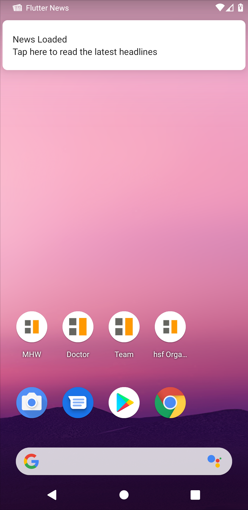
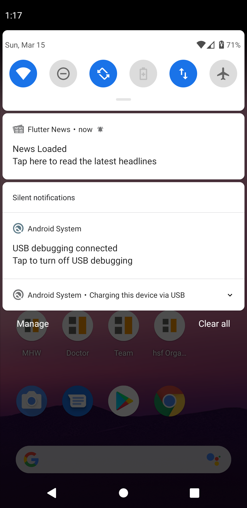

# Flutter News

A Flutter news application with the following features:
1. Pulls news from online service: http://rss.news.yahoo.com/rss
2. Has a settings page
a.	Provides option of background fetch when phone is on charge
b.	Provides a reminder option on a user specified time
3. If the Background fetch is enabled then shows the last fetched news with the time when it was fetched, and option to refresh.
4. If Background fetch is not enabled, then pull the news every-time user opens the app.
5. If reminder is set, user is prompted with notification to check news.

# Background fetch
Flutter News app uses the "background_fetch" plugin to run a background service every 15 minutes (configurable in main.dart) to check if the device is charging.
If it is, then it checks if the "Background fetch" option is enabled in the settings.
If the "news.xml" has not been updated that day, the app will run the scheduled background code to update the news.xml, and post a notification after the process is complete.

# Screenshots
 
 
 

