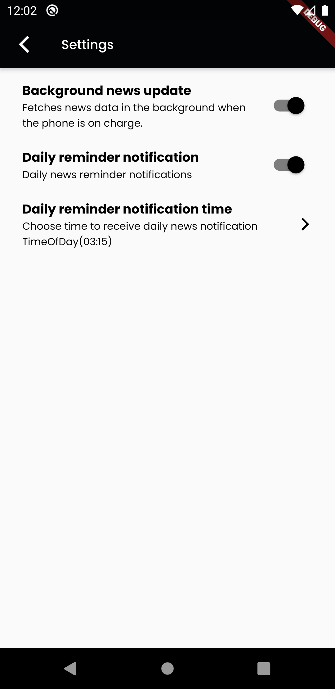
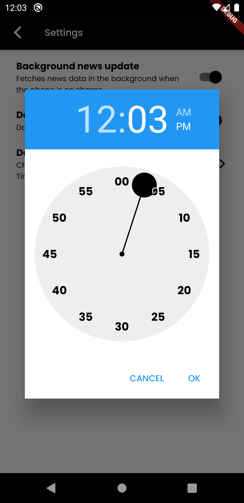
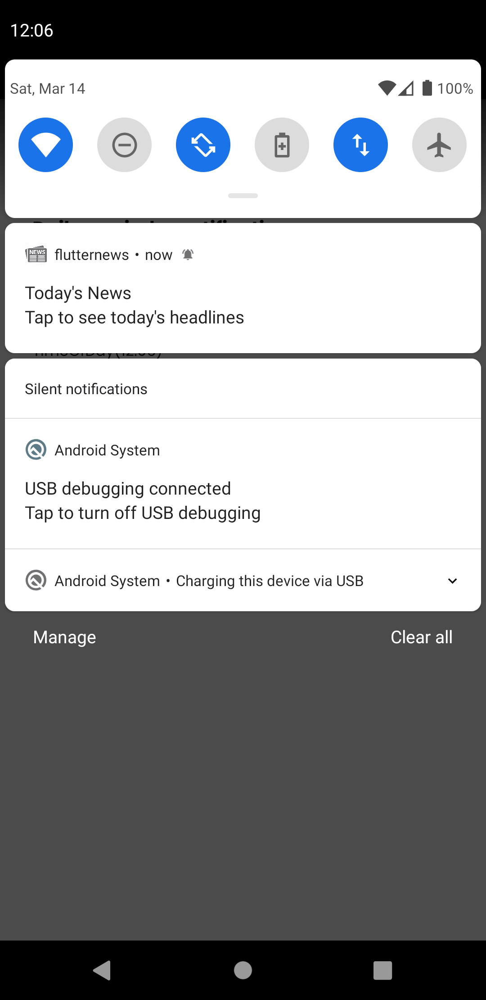

# flutter News

A Flutter news application with the following features:
1. Pull news from online service: http://rss.news.yahoo.com/rss
2. App should have a settings page
a.	Provide option of background fetch when phone is on charge
b.	Should provide a reminder option on a user specified time
3. If the Background fetch is enabled then show the last fetched news with the time when it was fetched and option to refresh
4. If Background fetch is not enabled then pull the news every-time user opens the app
5. If reminder is set, user should be prompted with notification to check news

